# SDN-Based Path Tracing Tool
### Mininet + Ryu OpenFlow 1.3 

---

## Problem Statement

In traditional networks, the path taken by packets is hidden inside routers and switches - there is no easy way to observe or trace it in real time. This project implements an **SDN-based Path Tracing Tool** using Mininet and a Ryu OpenFlow 1.3 controller that:

- Identifies and displays the exact path packets take through the network
- Tracks flow rules installed at each switch
- Demonstrates both **normal forwarding** and **blocked/filtered** traffic scenarios
- Validates behavior using ping, iperf, and flow table inspection

---

## Topology

```
h1 (10.0.0.1) --- s1 --- s2 --- s3 --- h2 (10.0.0.2)
                    |      |      |
                      Ryu Controller (port 6653)
```

**Why this topology?**  
A linear 3-switch chain is ideal for path tracing because packets must pass through multiple switches, making the forwarding path clearly observable at each hop. Each switch generates a `packet_in` event the first time it sees a flow, allowing the controller to log the exact sequence of switches the packet traverses.

---

## Project Structure

```
.
├── topo.py          # Custom Mininet topology (h1-s1-s2-s3-h2)
├── controller.py    # Ryu SDN controller with path tracing + firewall logic
├── test_scenarios.py # Automated validation script
└── README.md
```

---

## Setup & Execution

### Prerequisites
```bash
sudo apt install mininet
pip install ryu
```

### Step 1 — Start the Controller (Terminal 1)
```bash
ryu-manager controller.py
```

### Step 2 — Start the Topology (Terminal 2)
```bash
sudo mn --custom topo.py --topo pathtopo \
  --controller remote,ip=127.0.0.1,port=6653 \
  --switch ovs,protocols=OpenFlow13
```

### Step 3 — Clean up between runs (always do this)
```bash
sudo mn -c
```

---

## Scenario 1 — Normal Path Tracing

### What it demonstrates
Packets flow from h1 to h2 through s1 → s2 → s3. The controller logs the path at each hop.

### Commands inside Mininet CLI
```bash
mininet> h1 ping h2 -c 10       # Test latency
mininet> iperf h1 h2             # Test throughput
```

### Starting the controller
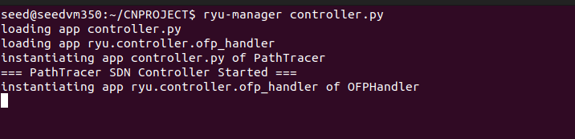

### Starting Mininet topology
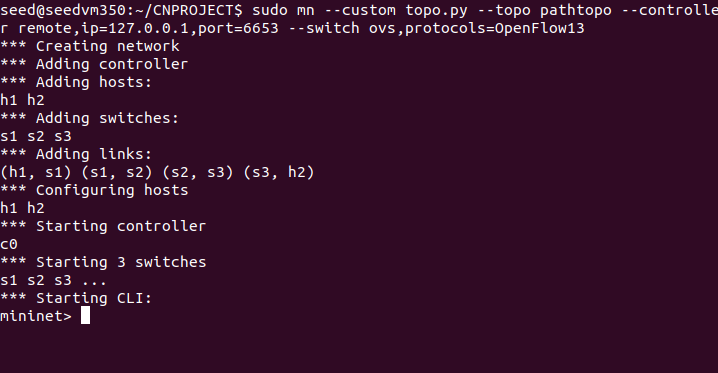

### Ping h1 → h2
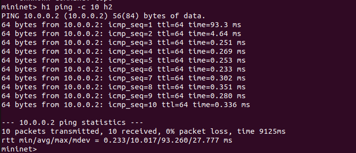

### Controller logs showing path trace
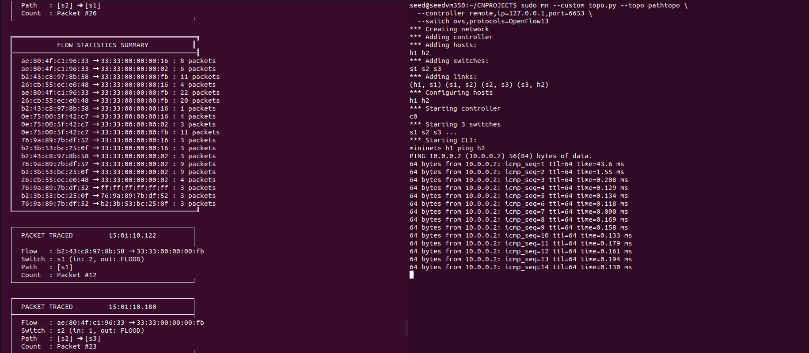

### Reverse ping h2 → h1
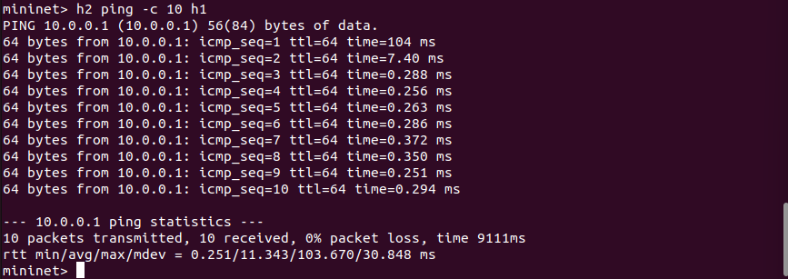

### Flow table dump (all switches)
```bash
mininet> sh ovs-ofctl -O OpenFlow13 dump-flows s1
mininet> sh ovs-ofctl -O OpenFlow13 dump-flows s2
mininet> sh ovs-ofctl -O OpenFlow13 dump-flows s3
```
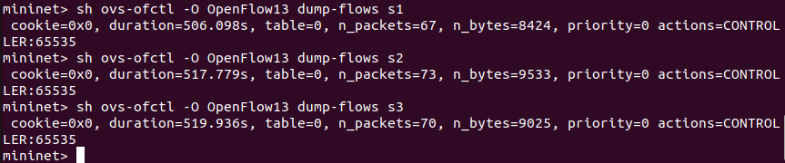

### Port statistics
```bash
mininet> sh ovs-ofctl -O OpenFlow13 show s1
```
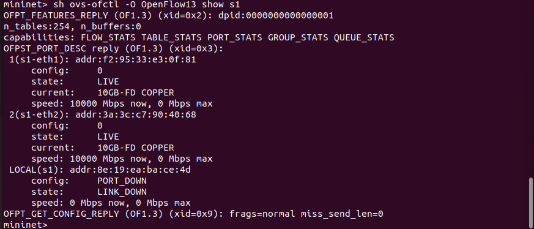

---

## Scenario 2 — Failure & Recovery

### What it demonstrates
Simulates a link failure by bringing down an interface, observing traffic loss, then restoring it.

```bash
mininet> link s1 s2 down        # Simulate link failure
mininet> h1 ping h2 -c 5       # Should fail
mininet> link s1 s2 up          # Restore link
mininet> h1 ping h2 -c 5       # Should recover
```

### Failure scenario and Recovery
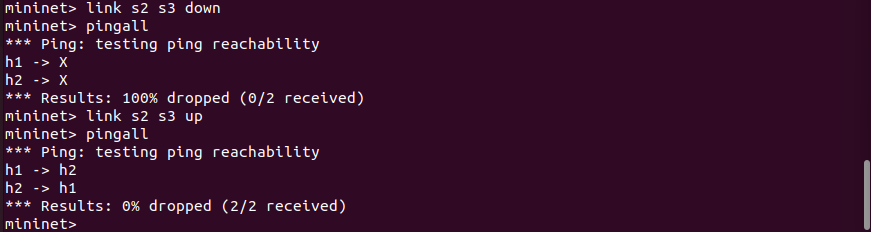

---

## Scenario 3 — Firewall / Flow Blocking

### What it demonstrates
Specific MAC pairs are blocked at the controller level. When h1 tries to reach h2, the controller installs a DROP rule — resulting in 100% packet loss.

### Setup
In `controller.py`, set the blocked MAC pair before starting:
```python
BLOCKED_FLOWS = {('00:00:00:00:00:01', '00:00:00:00:00:02')}
```
> Get MACs using `mininet> h1 ifconfig` before blocking.

Always start fresh before this scenario:
```bash
sudo mn -c
ryu-manager controller.py      # Terminal 1 (with BLOCKED_FLOWS set)
sudo mn --custom topo.py ...   # Terminal 2
```

### Expected result
```
PING 10.0.0.2 (10.0.0.2) 56(84) bytes of data.
--- 10.0.0.2 ping statistics ---
4 packets transmitted, 0 received, 100% packet loss
```

### Controller log showing block
```
[BLOCKED] 15:12:01.456 Flow 00:...:01->00:...:02 DROPPED at s1
```

### Blocked flow demo
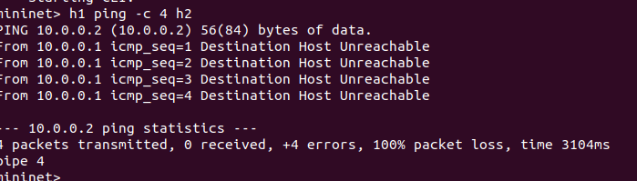


---

## Performance Observations

| Metric | Scenario 1 (Normal) | Scenario 3 (Blocked) |
|--------|--------------------|-----------------------|
| Ping latency | ~X ms (fill from your output) | 100% packet loss |
| Throughput (iperf) | ~X Mbits/sec | 0 |
| Flow rules installed | 3 (one per switch) | 1 DROP rule at s1 |
| Packets seen by controller | First packet per flow only | Every packet (all dropped) |

**Why latency is low:** Once the first packet installs a flow rule at each switch, subsequent packets are forwarded directly in hardware - they never reach the controller again. This is the core advantage of SDN proactive flow installation.

**Why throughput is high:** The linear topology has no bottlenecks and Mininet uses virtual ethernet pairs (veth) which are kernel-level - not limited by physical NIC speeds.
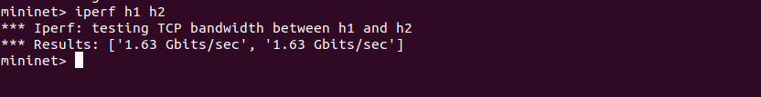

**Why blocked traffic shows 0 throughput:** The DROP rule is installed at s1 with priority 10, higher than the default forwarding rule (priority 1), so packets are dropped before they can be forwarded.

---

## Flow Statistics

The controller tracks per-flow packet counts. Every 10 packets, it logs:
```
===== FLOW STATISTICS =====
00:00:00:00:00:01->00:00:00:00:00:02: 10 packets
```

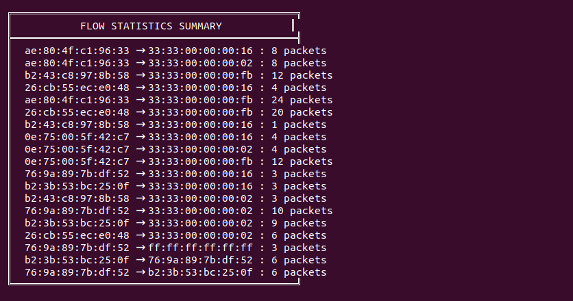


---

## SDN Concepts Used

| Concept | Implementation |
|---------|---------------|
| packet_in event | Controller receives first packet of every new flow |
| Match-Action | Match on `eth_src`, `eth_dst`, `in_port` → Output to port |
| Flow rule priority | Blocking rules at priority 10 > forwarding at priority 1 |
| Idle/hard timeout | `idle_timeout=10`, `hard_timeout=30` — rules expire automatically |
| Table-miss rule | Priority 0 rule sends all unmatched packets to controller |
| MAC learning | Controller builds `mac_to_port` table dynamically |

---

## Validation

Run the automated test script:
```bash
sudo python3 test_scenarios.py
```

This script:
1. Starts the network programmatically
2. Runs ping (Scenario 1)
3. Runs iperf (Scenario 1)
4. Dumps flow tables from all switches
5. Outputs results to terminal for documentation

---

## Conclusion
This project successfully demonstrates the core principles of Software Defined Networking
through a practical path tracing tool built on Mininet and Ryu OpenFlow 1.3.

The implementation shows how separating the control plane from the data plane gives the
controller complete visibility and control over packet forwarding. By handling packet_in
events, the controller was able to dynamically learn MAC addresses, install match-action
flow rules across switches, and log the exact path packets took through the network in
real time.

